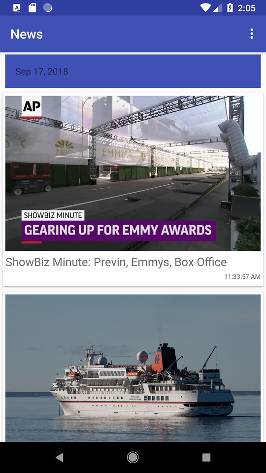

# Raye7AndroidDeveloperChallenge

## Getting Started

These instructions will get you a copy of the project up and running on your local machine for development and testing purposes.

Application loads news at startup, long clicking on a news will add it into favorites and will show a toast.
single click on a new will open web browser to view this news.
toolbar option menu toggles between favorites and news.

### Prerequisites

* [dagger 2](https://github.com/google/dagger)
* [rxjava](https://github.com/ReactiveX/RxJava)
* [retrofit](https://square.github.io/retrofit/)
* MVP Pattern
* [cardview](https://developer.android.com/guide/topics/ui/layout/cardview)
* [gson](https://github.com/google/gson)
* [glide](https://github.com/bumptech/glide)
* [recyclerview](https://developer.android.com/guide/topics/ui/layout/recyclerview)

## Authors

* **Mohamed gomaa** - [gom3az](https://github.com/gom3az)

## Screenshots

     
         
     
     
    

